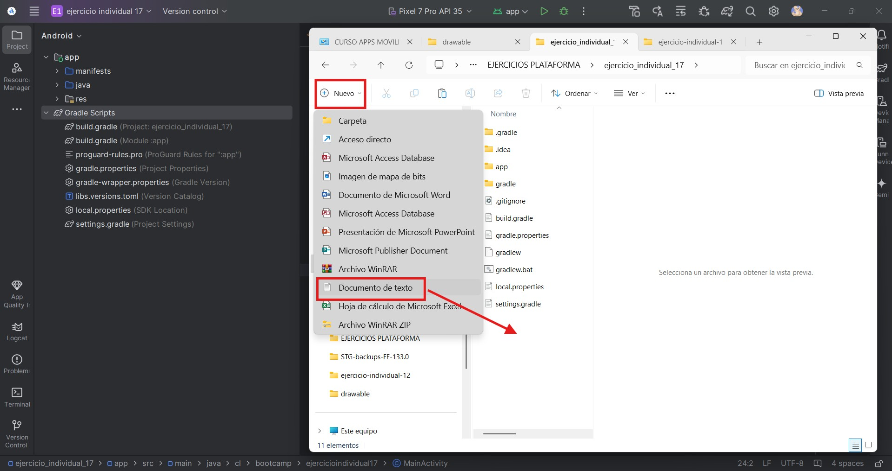
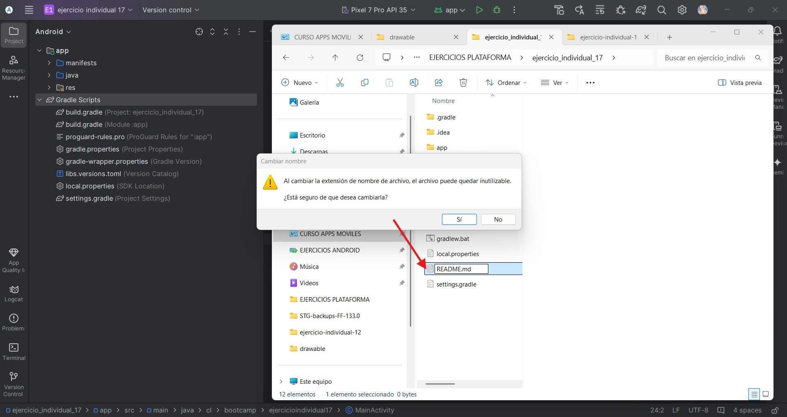
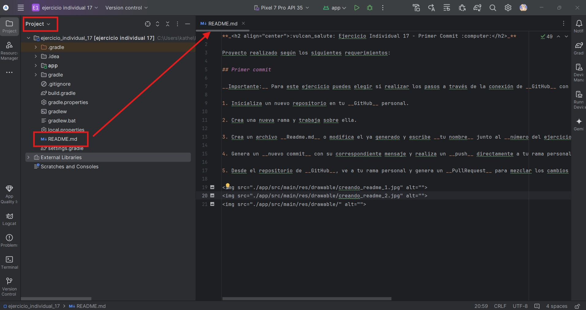
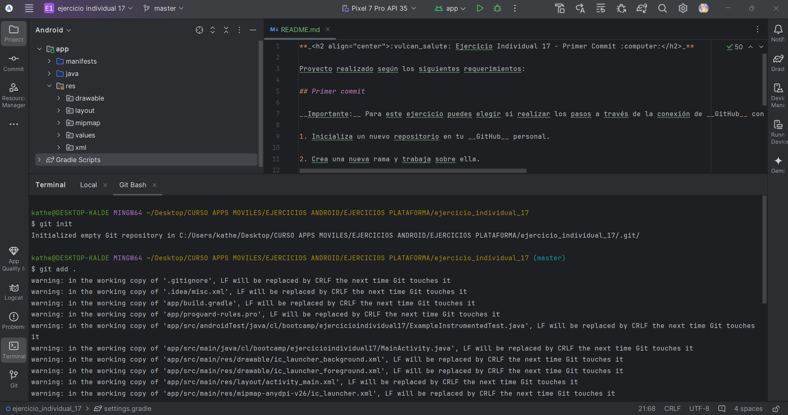
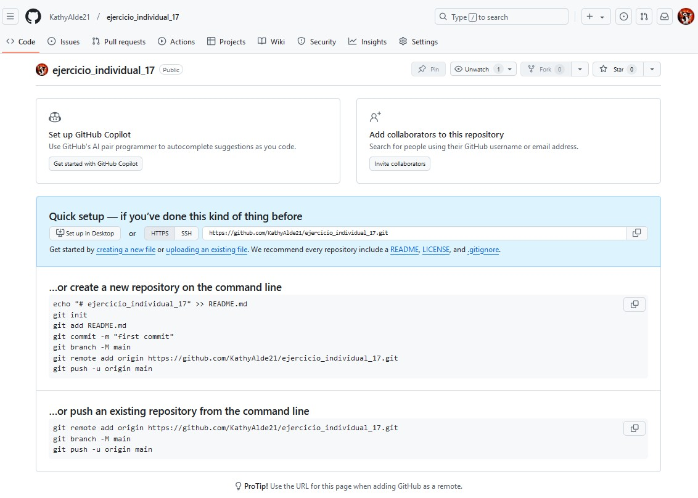
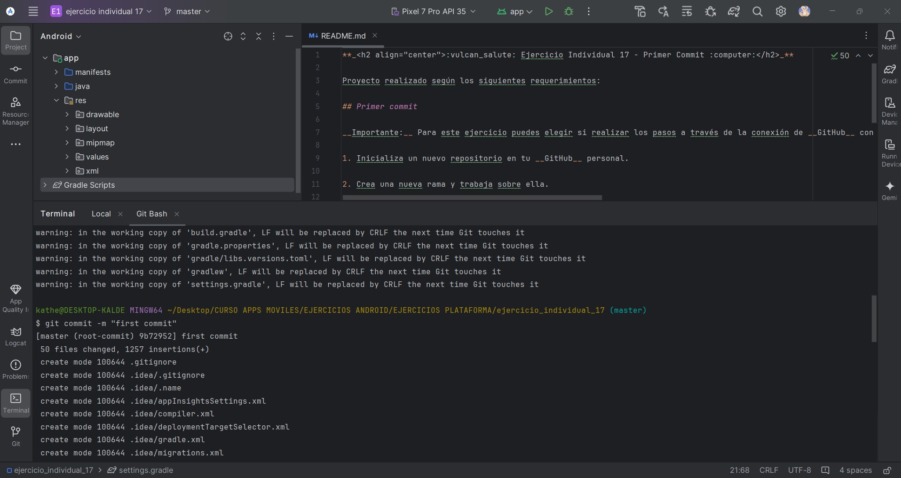
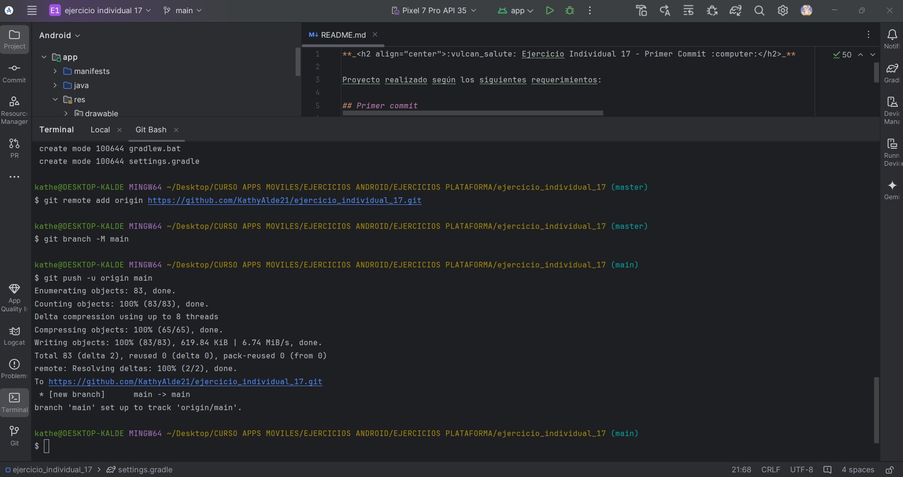
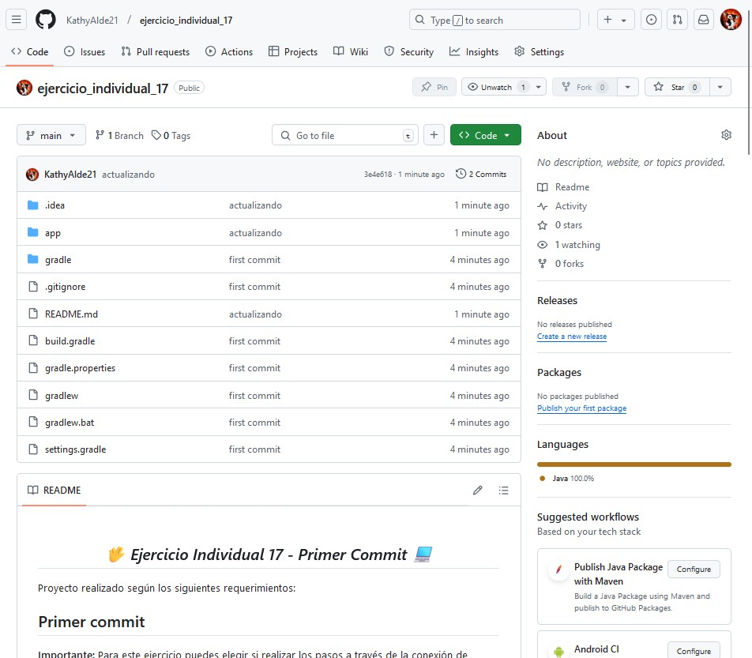

**_<h2 align="center">:vulcan_salute: Ejercicio Individual 17 - Primer Commit :computer:</h2>_**

Proyecto realizado según los siguientes requerimientos:

## Primer commit

__Importante:__ Para este ejercicio puedes elegir si realizar los pasos a través de la conexión de __GitHub__ con __AndroidStudio__ o directamente con comandos en la consola _(Bash)_ de Git. _(Saca capturas de los procesos)_

1. Inicializa un nuevo repositorio en tu __GitHub__ personal.

2. Crea una nueva rama y trabaja sobre ella.

3. Crea un archivo __Readme.md__ o modifica el ya generado y escribe __tu nombre__ junto al __número del ejercicio__ que estás realizando.

4. Genera un __nuevo commit__ con su correspondiente mensaje y realiza un __push__ directamente a tu rama personal que se encuentra en la nube.

5. Desde el repositorio de __GitHub__, ve a tu rama personal y genera un __PullRequest__ para mezclar los cambios con la rama principal.

